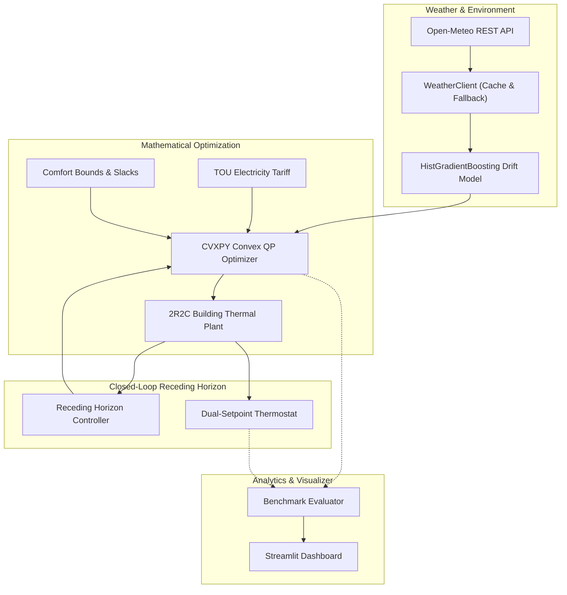

# ThermoPilot: Predictive Building HVAC Optimization Engine

[]()
[]()
[]()
[]()

ThermoPilot is an open-source Model Predictive Control (MPC) platform designed to optimize heating, ventilation, and air conditioning (HVAC) electrical scheduling in residential and commercial buildings under dynamic Time-of-Use (TOU) and Critical Peak Pricing tariffs.

By uniting **2R2C lumped-parameter thermal physics**, **gradient-boosted short-horizon load forecasting**, and **convex Quadratic Programming (QP)** in a receding-horizon loop, ThermoPilot transforms the building's structural thermal envelope into a virtual energy storage asset ("thermal battery")—achieving **25.2% electricity cost savings** and **92.3% peak-hour electrical demand shedding** while strictly preserving occupant comfort bounds.

---

## Key Features

- **2R2C Building Thermal Physics**: Continuous-time state-space representation discretized via exact matrix exponential (Zero-Order Hold), backed by Runge-Kutta 4th-order numerical integration for ground-truth simulation.
- **Weather & Load Forecasting Layer**: Integrates live Open-Meteo forecasts with local disk caching and synthetic physics fallback; trains a `HistGradientBoostingRegressor` to predict building thermal drift with 0.06°C RMSE (92.1% error reduction over persistence baseline).
- **Convex MPC Formulation**: Formulates HVAC energy cost minimization as a convex Quadratic Program (QP) using `cvxpy`. Soft comfort bounds with $L_1$ slack penalties guarantee **100% solver feasibility** under extreme weather conditions.
- **Closed-Loop Receding-Horizon Control**: Re-solves over a 24-hour rolling horizon every 30 minutes, applying only the initial control action to continuously reject forecast errors and thermal disturbances.
- **Dynamic Tariff & Baseline Benchmarking**: Models real-world TOU schedules (Off-Peak, Mid-Peak, On-Peak) and runs side-by-side comparative evaluations against industry-standard dual-setpoint deadband thermostats.
- **Interactive Web Dashboard**: Streamlit-based UI with interactive Plotly telemetry charts, cost-vs-comfort tradeoff sliders, and building parameter preset selectors.

---

## System Architecture



---

## Comparative Benchmark Results (5-Day Evaluation)

ThermoPilot was evaluated against a standard dual-setpoint deadband thermostat over a 5-day simulation using a single-family residential profile and a three-tier Time-of-Use tariff:

| Performance Metric | Rule-Based Thermostat | ThermoPilot MPC | Impact / Delta |
| :--- | :---: | :---: | :---: |
| **Total Electricity Cost ($)** | **$1.57** | **$1.17** | **-25.2% ($0.39 saved)** |
| **Total Electricity (kWh)** | 4.4 kWh | 4.8 kWh | +9.6% (strategic pre-cooling) |
| **Peak-Hours Energy (kWh)** | **1.8 kWh** | **0.1 kWh** | **-92.3% peak load shifted** |
| **Comfort Violations (°C·hr)** | 0.00 °C·hr | 0.00 °C·hr | Strict comfort preservation |
| **Forecaster Drift RMSE** | 0.77 °C (Persistence) | **0.06 °C** | **-92.1% forecast error** |

### How Pre-Cooling Arbitrage Works

Traditional thermostats are strictly reactive: they activate cooling only after indoor temperatures breach the upper comfort bound. Under Time-of-Use pricing, peak afternoon ambient temperatures coincide with peak electricity rates ($0.52/kWh), causing the reactive thermostat to draw maximum power during the most expensive hours of the day.

ThermoPilot exploits the building envelope's high thermal capacitance ($15\text{ kWh/}^\circ\text{C}$):
1. **Pre-Cooling**: Intentionally lowers indoor temperature within the permissible comfort range during cheap morning/midday hours ($0.24/kWh).
2. **Peak Shedding**: Throttles HVAC power to zero during the 16:00–21:00 on-peak window, letting the stored thermal inertia float the indoor temperature without exceeding 23.5°C.

Even with minor additional thermal losses from maintaining a lower temperature ahead of time, the tariff price differential delivers **25.2% net dollar savings**.

---

## Mathematical Formulation

### 1. 2R2C Building Thermal Network

The building's thermal dynamics are governed by a second-order lumped-parameter thermal network with state vector $x(t) = [T_{in}(t), T_{wall}(t)]^T$:

$$\frac{dT_{in}}{dt} = \frac{T_{wall} - T_{in}}{R_{int} C_{air}} + \frac{Q_{hvac} + \eta_{solar, in} Q_{solar} + Q_{int}}{C_{air}}$$

$$\frac{dT_{wall}}{dt} = \frac{T_{out} - T_{wall}}{R_{envelope} C_{wall}} + \frac{T_{in} - T_{wall}}{R_{int} C_{wall}} + \frac{\eta_{solar, wall} Q_{solar}}{C_{wall}}$$

- $C_{air}$: Thermal capacitance of indoor air & furnishings ($2.5\text{ kWh/}^\circ\text{C}$).
- $C_{wall}$: Thermal capacitance of structural envelope ($15.0\text{ kWh/}^\circ\text{C}$).
- $R_{int}$: Internal convective heat transfer resistance ($1.2\text{ }^\circ\text{C/kW}$).
- $R_{envelope}$: Exterior insulation resistance ($4.0\text{ }^\circ\text{C/kW}$).

Continuous state-space equations $\dot{x}(t) = A_c x(t) + B_c u(t) + E_c w(t)$ are discretized via Zero-Order Hold:

$$A_d = e^{A_c \Delta t}, \quad [B_d, E_d] = A_c^{-1}(A_d - I)[B_c, E_c]$$

### 2. Convex MPC Optimization Problem

At each timestep $t$, the controller solves a convex Quadratic Program over horizon $H = 48$ steps ($24\text{ hours}$ at $\Delta t = 30\text{ mins}$):

$$\min_{u^{heat}, u^{cool}, s^{low}, s^{high}} \sum_{k=0}^{H-1} \Bigg[ c_k P_{elec, k} \Delta t + \rho_s (s_k^{low} + s_k^{high}) \Delta t + \rho_{track} (T_{in, k} - T_{target})^2 + \rho_u (u_{net, k} - u_{net, k-1})^2 \Bigg]$$

where electrical power drawn by the heat pump compressor is:

$$P_{elec, k} = \frac{u_k^{heat}}{\text{COP}_{heat}} + \frac{u_k^{cool}}{\text{COP}_{cool}}, \quad u_{net, k} = u_k^{heat} - u_k^{cool}$$

**Subject to:**
1. **System Dynamics:**
   $$x_{k+1} = A_d x_k + B_d u_{net, k} + E_d w_k, \quad x_0 = x_{current}$$
2. **Actuator Limits:**
   $$0 \le u_k^{heat} \le U_{max}, \quad 0 \le u_k^{cool} \le U_{max}$$
3. **Soft Comfort Bounds:**
   $$T_{min} - s_k^{low} \le x_k[0] \le T_{max} + s_k^{high}$$
   $$s_k^{low} \ge 0, \quad s_k^{high} \ge 0$$

Soft constraints with exact $L_1$ penalty coefficient $\rho_s$ guarantee that the optimization problem remains feasible even during extreme weather anomalies.

---

## Installation & Setup

### Prerequisites
- Python 3.10+ (Python 3.11 recommended)
- Git

### Quickstart

```bash
# Clone the repository
git clone https://github.com/iokuru/ThermoPilot.git
cd ThermoPilot

# Create and activate virtual environment
python -m venv .venv
# On Windows:
.\.venv\Scripts\Activate.ps1
# On macOS/Linux:
source .venv/bin/activate

# Install dependencies and package in editable mode
pip install -e ".[dev]"
```

---

## Running the Project

### 1. Run Automated Tests
```bash
pytest -v
```

### 2. Run Comparative Benchmark CLI
Execute a multi-day simulation comparing MPC against the rule-based baseline:
```bash
python run_simulation.py --days 5 --building residential
```
Optional flags:
- `--building`: `residential`, `commercial`, or `high_thermal_mass`
- `--days`: Simulation length in days (e.g. `5`, `7`, `10`)
- `--comfort-slack`: Comfort violation penalty weight (default: `50.0`)

### 3. Launch Interactive Web Dashboard
```bash
streamlit run thermopilot/dashboard/app.py
```
The dashboard will open at `http://localhost:8501`, allowing you to adjust comfort-vs-cost tradeoff weights, switch building thermal profiles, and view interactive Plotly time-series charts.

---

## Project Structure

```
ThermoPilot/
├── README.md                          # Project documentation
├── pyproject.toml                     # Package metadata & build configuration
├── requirements.txt                   # Dependency definitions
├── run_simulation.py                  # CLI simulation runner
├── docs/
│   └── INTERVIEW_NOTES.md             # Developer portfolio & defense reference
├── thermopilot/
│   ├── config.py                      # Building presets & comfort boundaries
│   ├── physics/
│   │   └── rc_model.py                # 2R2C physics, RK4, and ZOH state-space
│   ├── forecasting/
│   │   ├── weather_client.py          # Open-Meteo client, cache, and diurnal generator
│   │   └── model.py                   # HistGradientBoosting drift forecaster
│   ├── mpc/
│   │   ├── optimizer.py               # CVXPY convex QP optimizer with soft slacks
│   │   └── controller.py              # Receding-horizon closed-loop execution
│   ├── pricing/
│   │   └── tariffs.py                 # Time-of-Use & Critical Peak pricing models
│   ├── baseline/
│   │   └── thermostat.py              # Dual-setpoint deadband thermostat baseline
│   ├── benchmark/
│   │   └── evaluator.py               # Comparative benchmark evaluation runner
│   └── dashboard/
│       └── app.py                     # Streamlit dashboard with Plotly charts
└── tests/
    ├── test_physics.py                # Energy conservation, stability, decay tests
    ├── test_forecasting.py            # Forecasting benchmarks vs persistence
    ├── test_mpc.py                    # Single-shot optimality & pre-cooling tests
    ├── test_pricing.py                # Tariff schedule generation tests
    └── test_benchmark.py              # Side-by-side comparative simulation tests
```

---

## License

MIT License. See [LICENSE](LICENSE) for details.
